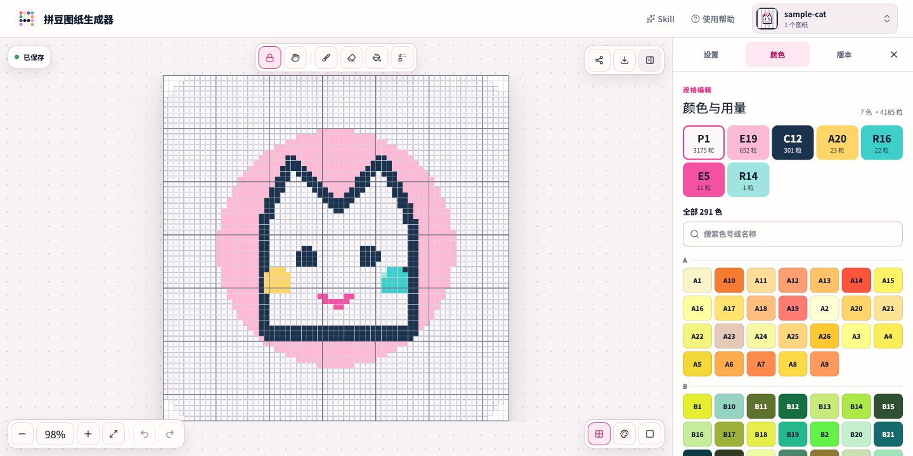

# 业务背景
新增拼豆项目业务系统功能

# 功能列表
## 1. 输入图片生成拼豆像素风的图片
- 前端页面在拼豆项目-生成拼豆像素风图片 下方展示"上传图片"按钮
- 用户点击上传图片按钮，弹出文件选择器，用户选择图片后，点击确认上传
- 后台收到图片后，调用拼豆像素风图片生成接口，生成拼豆像素风图片
- 生成的拼豆像素风图片返回给前端，前端展示在拼豆项目-生成拼豆像素风图片 下方展示"生成的拼豆像素风图片"区域

## 2. 更详细的用户输入提示词作为生成图片的依据
- 前端页面在拼豆项目-生成拼豆像素风图片 下方展示"输入提示词"区域
- 用户在输入提示词区域输入更详细的提示词，例如："生成一个拼豆像素风的图片，拼豆像素风的图片中包含一个拼豆像素风的图片"
- 后台收到用户输入的提示词后，调用拼豆像素风图片生成接口，生成拼豆像素风图片
- 生成的拼豆像素风图片返回给前端，前端展示在拼豆项目-生成拼豆像素风图片 下方展示"生成的拼豆像素风图片"区域

## 3. 确认生成的图片后输出拼豆图纸
- 用户点击确认生成按钮，弹出确认弹窗，用户确认拼豆像素风图片后，生成拼豆图纸
- 使用 image-to-pindou skill 生成拼豆图纸，图纸上应该包括坐标和标准拼豆颜色序号
- 标准化规则：
  - 图纸导出的 PNG 和 SVG 都需要包含行列坐标
  - 图纸中的颜色序号统一从 1 开始，和色板、图例保持一致
  - 图例中需要展示颜色序号与色值，便于用户对照购买和排版

# 使用Skills
- image-to-pindou：https://pindou.kuizuo.me/skill
- Github地址：https://github.com/kuizuo/pin-dou
- skill安装命令：npx skills add kuizuo/pin-dou --skill image-to-pindou -g -y
- 使用：$image-to-pindou，把这张图片做成 50×50 的拼豆图纸，移除背景，最多使用 18 种颜色。
